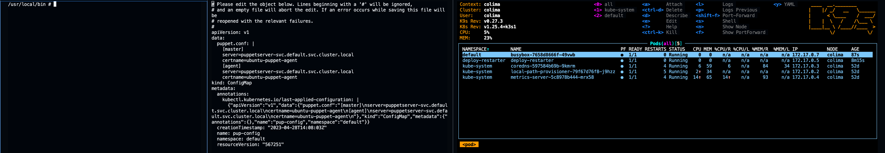
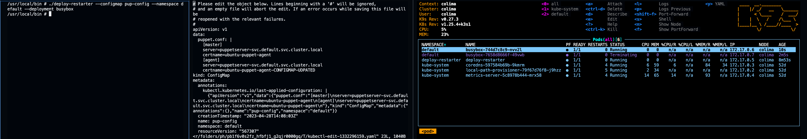

# deploy-restarter

---

A CLI that, when provided with a config map and a deployment within a namespace, updates deployment's `spec.template.metadata.annotations` with annotation key `"heb.com/default-pup-config"`, with value being the SHA of configmap's data, thus causing a rolling restart of the deployment whenever configmap changes.

---

## Usage

```
$ deploy-restarter
Usage: deploy-restarter [options]
Options:
  -configmap string
    	changes to this config map cause updated annotation to deployment
  -deployment string
    	deployment that needs to be updated
  -namespace string
    	namespace under which these resources exist
```

### Example

Terminal 1 shows a pod that has the deploy-restarter cli, second shows configmap that the cli looks at, and third, a pod based off of the deployment being annotated in case of changes to the configmap.

Before:



Once the cli runs, it looks at the updated configmap (terminal 2) and updates deployment's annotation (shown in the third image) which causes it's underlying pods to be restarted. (terminal 3)



Image showing dpeloyment's annotation being updated by the cli:


### Tests

```
Run go tests:
$ go test ./... -cover
?       deploy-restarter/cmd    [no test files]
ok      deploy-restarter/pkg/apiCaller  0.487s  coverage: 87.2% of statements
ok      deploy-restarter/util/helpers   0.127s  coverage: 84.9% of statements
```
