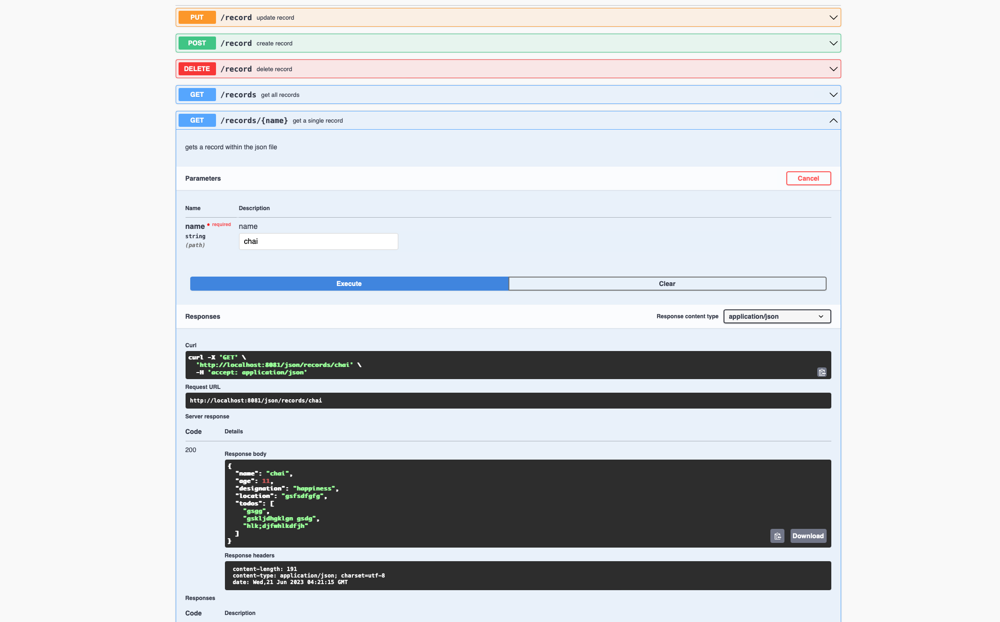

# Simple Json App:

The idea behind this app is simple, it creates a new data.json file in current working directory, and starts exposing APIs to perform CRUD operations on the created json file.

## usage

Run project

```bash
$ go run main.go
```

Swagger page [here](http://localhost:8081/swagger/index.html)

Swagger home:


Examples:



## todo

- Auth and other cleanups
